# Analog Soil Moisture Sensor & Automated Irrigation Circuit

[](#voltage-comparator-stage-ic1-lm741)
[](#interactive-tinkercad-simulation)

A discrete analog soil moisture detection and automated irrigation driver circuit engineered using an **LM741 Operational Amplifier** as an open-loop voltage comparator. The circuit dynamically samples electrical resistance variations across dual soil probe electrodes to drive an electromechanical SPDT relay and automated 12V DC water pump without microcontrollers, firmware, or software abstraction layers.

---

## Live Operation Demonstration

<p align="center">
  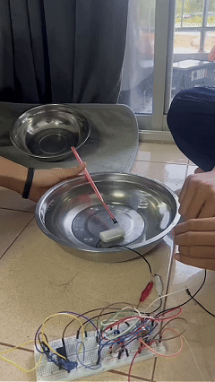
</p>
<p align="center">
  <em>Live closed-loop automated irrigation test in action.</em>
</p>

---

## Table of Contents

- [Project Overview](#project-overview)
- [System Architecture & Block Diagram](#system-architecture--block-diagram)
- [Circuit Principles & Working Mechanism](#circuit-principles--working-mechanism)
  - [Designator Cross-Reference Mapping](#designator-cross-reference-mapping)
  - [1. Soil Probe Resistive Divider Stage](#1-soil-probe-resistive-divider-stage)
  - [2. Sensitivity Calibration & Reference Stage](#2-sensitivity-calibration--reference-stage)
  - [3. Voltage Comparator Stage (`IC1: LM741`)](#3-voltage-comparator-stage-ic1-lm741)
  - [4. BJT Switching & Relay Driver Stage (`Q1: BC547B`)](#4-bjt-switching--relay-driver-stage-q1-bc547b)
  - [5. Inductive Transient Clamping (Flyback Protection)](#5-inductive-transient-clamping-flyback-protection)
- [Bill of Materials (BOM)](#bill-of-materials-bom)
- [Circuit Schematics & Wiring Diagrams](#circuit-schematics--wiring-diagrams)
  - [Academic Circuit Schematic Diagram](#academic-circuit-schematic-diagram)
  - [Autodesk Tinkercad Schematic Diagram](#autodesk-tinkercad-schematic-diagram)
  - [Tinkercad Simulation Breadboard Layout](#tinkercad-simulation-breadboard-layout)
- [Interactive Tinkercad Simulation](#interactive-tinkercad-simulation)
- [Hardware Prototype & Breadboard Verification](#hardware-prototype--breadboard-verification)
- [Engineering Analysis & Observations](#engineering-analysis--observations)
- [Repository Structure](#repository-structure)
- [Author & Academic Reference](#author--academic-reference)

---

## Project Overview

Automated irrigation systems commonly deploy over-engineered microcontrollers (such as Arduino, ESP32, or STM32) for simple threshold-triggered operations. While microcontrollers offer programmability, they introduce unnecessary software overhead, power consumption, firmware failure points, and high bill-of-materials (BOM) costs.

This project demonstrates a pure hardware-driven, closed-loop analog control system:

1. **Conductometric Soil Moisture Sensing:** Converts variable soil resistance ($R_{\text{soil}}$) into an analog voltage divider signal.
2. **Analog Differential Comparison:** Compares the probe potential against a user-calibrated reference voltage ($V_{\text{ref}}$) via an LM741 operational amplifier.
3. **Current-Amplified Actuation:** Drives an electromechanical relay through an NPN BJT transistor to switch a high-current 12V DC water pump.
4. **Autonomous Operation:** Requires zero programming, zero analog-to-digital conversions (ADC), and operates reliably from a single 12V DC supply rail.

---

## System Architecture & Block Diagram

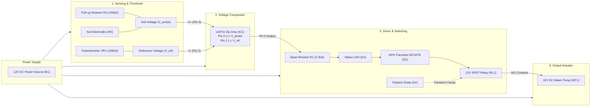

---

## Circuit Principles & Working Mechanism

The system operates across 5 discrete, interconnected functional stages that translate analog soil electrical resistance into electromechanical water pump actuation:

<p align="center">
  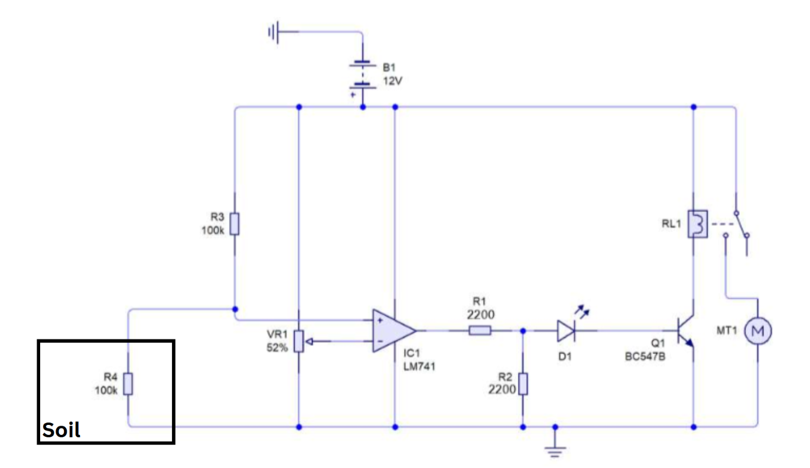
</p>
<p align="center">
  <em>Figure 1: Full system schematic diagram showing the 5 functional stages: (1) Soil Probe Divider, (2) Threshold Reference, (3) LM741 Comparator, (4) BJT Relay Switch, and (5) Inductive Clamping.</em>
</p>

### Designator Cross-Reference Mapping

To maintain clarity when referencing the academic laboratory schematic, the Autodesk Tinkercad simulation, and the physical breadboard prototype, the following cross-reference table correlates all component designations:

| Functional Stage | Academic Schematic (`schematic.png`) | Tinkercad Model (`tinkercad_schematic.png`) | Nominal Value / Part | Circuit Role |
| :--- | :---: | :---: | :---: | :--- |
| **1. Sensing Bias** | $R_3$ | $R_1$ | $100\text{ k}\Omega$ | Pull-up bias resistor connected to $+12\text{V}$ rail |
| **1. Soil Sensor** | $R_4$ ($R_{\text{soil}}$) | `RPOT2` | $0\text{--}100+\text{ k}\Omega$ | Conductive soil probe / variable resistance to $\text{GND}$ |
| **2. Threshold Calibration** | $VR_1$ | `RPOT3` | $100\text{ k}\Omega$ | Rotary potentiometer providing reference potential ($V_{\text{ref}}$) |
| **3. Voltage Comparator** | $IC_1$ | $U_1$ | LM741CN (DIP-8) | Open-loop differential comparator comparing $V_{\text{probe}}$ & $V_{\text{ref}}$ |
| **4. Base Current Limiter** | $R_1$ | $R_3$ | $2.2\text{ k}\Omega$ | Limits LM741 output current into transistor base |
| **4. Base Bleeder Resistor** | $R_2$ | $R_2$ | $2.2\text{ k}\Omega$ / $2.0\text{ k}\Omega$ | Pulls base to $\text{GND}$ ensuring clean cutoff despite op-amp $V_{OL}$ |
| **4. Status Indicator** | $D_1$ | $D_1$ | Red LED ($V_F \approx 2\text{V}$) | Visual indicator & level shifter ($V_F$) for noise immunity |
| **4. Switching Transistor** | $Q_1$ | $T_1$ | BC547B (NPN BJT) | Common-emitter saturation switch energizing relay coil |
| **4. SPDT Relay** | $RL_1$ | $K_2$ | 12V DC Relay | Isolates logic rail and switches high-current 12V motor |
| **4. Irrigation Pump** | $MT_1$ | $M_1$ | 12V DC Motor Pump | Delivers fluid to soil substrate when energized |
| **5. Flyback Diode** | $D_2$ | $D_2$ | 1N4007 / 1N4148 | Anti-parallel clamp suppressing inductive reverse-EMF transients |

---

### 1. Soil Probe Resistive Divider Stage

Two metallic electrodes inserted into the soil substrate act as a variable resistor ($R_{\text{soil}}$ / $R_4$ in schematic, `RPOT2` in Tinkercad). The probe forms a passive voltage divider with pull-up resistor $R_3$ ($100\text{ k}\Omega$):

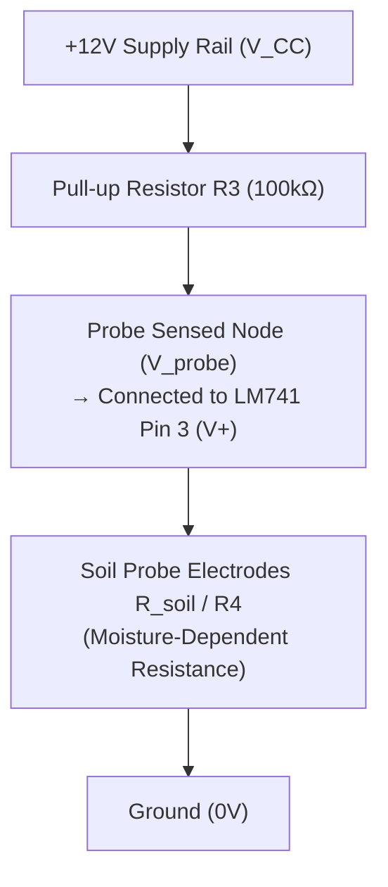

The sensed potential $V_{\text{probe}}$ delivered to the non-inverting input (`Pin 3`) of the op-amp is governed by the voltage divider equation:

$$V_{\text{probe}} = V_{CC} \times \frac{R_{\text{soil}}}{R_3 + R_{\text{soil}}}$$

- **Wet Soil (Moist State):** Water containing dissolved minerals and ions creates multiple parallel conductive paths, causing soil electrical resistance to drop significantly ($R_{\text{soil}} \approx 10\text{ k}\Omega\text{--}30\text{ k}\Omega$). Because $R_{\text{soil}} \ll R_3$, the divider pulls $V_{\text{probe}}$ low toward ground:
  $$V_{\text{probe}} = 12\text{V} \times \frac{20\text{ k}\Omega}{100\text{ k}\Omega + 20\text{ k}\Omega} = 2.0\text{V} \quad (< V_{\text{ref}})$$
- **Dry Soil (Dehydrated State):** As soil moisture evaporates, ionic conduction ceases and resistance escalates dramatically ($R_{\text{soil}} > 150\text{ k}\Omega$, extending into the megaohm range). Because $R_{\text{soil}} \gg R_3$, the divider pulls $V_{\text{probe}}$ high toward the supply rail:
  $$V_{\text{probe}} = 12\text{V} \times \frac{200\text{ k}\Omega}{100\text{ k}\Omega + 200\text{ k}\Omega} = 8.0\text{V} \quad (> V_{\text{ref}})$$

---

### 2. Sensitivity Calibration & Reference Stage

A $100\text{ k}\Omega$ linear rotary potentiometer ($VR_1$ in schematic, `RPOT3` in Tinkercad) is connected across $+12\text{V}$ and $\text{GND}$ to establish a user-adjustable reference threshold voltage ($V_{\text{ref}}$) at its wiper:

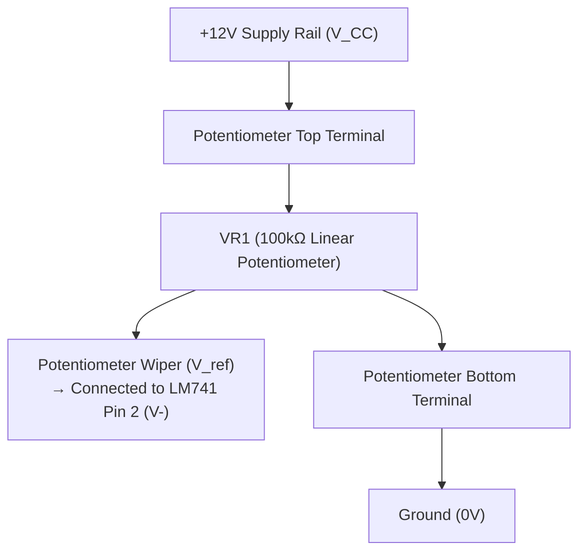

The reference potential supplied to the inverting input (`Pin 2`) is defined by:

$$V_{\text{ref}} = \alpha \cdot V_{CC} \quad (0 \le \alpha \le 1)$$

- **Calibration Setting:** Setting the wiper at approximately $50\%$ ($\alpha \approx 0.50\text{--}0.52$) yields $V_{\text{ref}} \approx 6.0\text{V}\text{--}6.24\text{V}$, providing an optimal midpoint between typical wet soil voltages ($< 3.5\text{V}$) and dry soil voltages ($> 6.5\text{V}$).
- Adjusting $VR_1$ allows calibration for different soil textures (e.g., sandy loam, clay, or peat moss) and plant species with varying moisture requirements without replacing any circuit hardware.

---

### 3. Voltage Comparator Stage (`IC1: LM741`)

The LM741 operational amplifier (`IC1` in schematic, `U1` in Tinkercad) operates in an **open-loop comparator configuration** without negative feedback. With no feedback loop, the differential open-loop voltage gain ($A_{OL} \approx 200,000$) immediately drives the output to its positive or negative rail:

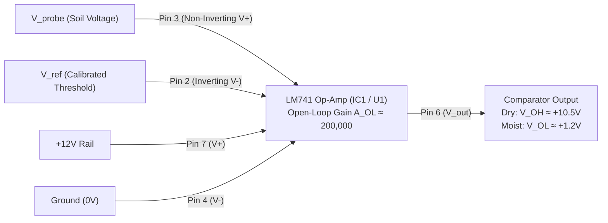

**Differential Transfer Characteristic:**

$$
V_{\text{out}} = \begin{cases}
V_{OH} \approx V_{CC} - 1.5\text{V} \approx +10.5\text{V} & \text{if } V_{\text{probe}} > V_{\text{ref}} \quad \text{(Dry Soil: PUMP ON)} \\
V_{OL} \approx 0\text{V to } 1.5\text{V} & \text{if } V_{\text{probe}} < V_{\text{ref}} \quad \text{(Wet Soil: PUMP OFF)}
\end{cases}
$$

| Operating State | Moisture Level | Sensed Voltage Condition | Comparator Output ($V_{\text{out}}$) | Driver ($Q_1$) | Relay ($RL_1$) | Pump State |
| :--- | :---: | :---: | :---: | :---: | :---: | :---: |
| **Dry Soil** | Low | $V_{\text{probe}} > V_{\text{ref}}$ ($\approx 8.0\text{V} > 6.0\text{V}$) | $V_{OH} \approx +10.5\text{V}$ (High) | Saturated ON | Energized (Closed) | **ACTIVE (Irrigating)** |
| **Moist Soil** | High | $V_{\text{probe}} < V_{\text{ref}}$ ($\approx 2.0\text{V} < 6.0\text{V}$) | $V_{OL} \approx 1.2\text{--}1.5\text{V}$ (Low) | Cutoff OFF | De-energized (Open) | **STANDBY (Idle)** |

---

### 4. BJT Switching & Relay Driver Stage (`Q1: BC547B`)

Because the LM741 output current is limited ($\le 25\text{ mA}$ short-circuit limit), it cannot directly energize an electromechanical relay coil requiring $35\text{--}45\text{ mA}$. An NPN bipolar junction transistor ($Q_1$: BC547B in schematic, $T_1$ in Tinkercad) functions as a common-emitter saturation switch:

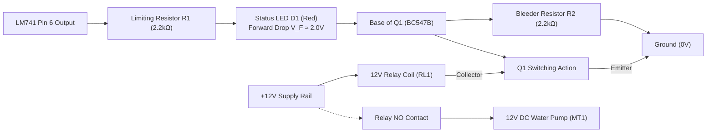

- **Dry Soil Actuation (Turn-ON):**
  When $V_{\text{out}}$ swings high ($+10.5\text{V}$), forward current passes through current-limiting resistor $R_1$ ($2.2\text{ k}\Omega$) and status LED $D_1$ into the base:
  $$I_B = \frac{V_{OH} - V_{D1} - V_{BE}}{R_1} \approx \frac{10.5\text{V} - 2.0\text{V} - 0.7\text{V}}{2200\,\Omega} \approx 3.55\text{ mA}$$
  With minimum DC current gain $h_{FE} \ge 200$, the base current supports collector current up to $I_C = h_{FE} \cdot I_B > 700\text{ mA}$, driving $Q_1$ into deep saturation ($V_{CE(\text{sat})} \approx 0.1\text{--}0.2\text{V}$). This energizes the $12\text{V}$ relay coil ($RL_1$ / $K_2$), closing the **Normally Open (NO)** contact and delivering $12\text{V}$ power to the water pump motor ($MT_1$ / $M_1$).
- **Moist Soil De-Actuation & Noise Margin (Turn-OFF):**
  Due to single-supply LM741 architecture, $V_{OL}$ cannot reach true ground and rests around $+1.2\text{V}$ to $+1.5\text{V}$. The combined threshold of LED $D_1$ ($V_F \approx 2.0\text{V}$) and $V_{BE}$ ($0.7\text{V}$) equals $2.7\text{V}$. Because $V_{OL} < 2.7\text{V}$, no forward current can reach the base. Resistor $R_2$ ($2.2\text{ k}\Omega$) shunts residual leakage to ground, guaranteeing total cutoff ($I_C = 0\text{ mA}$, Relay de-energized, Pump OFF).
- **Status Indicator LED ($D_1$):**
  LED $D_1$ serves a dual function: it provides immediate visual operational feedback (glowing red during active watering) while simultaneously acting as an analog voltage level shifter.

---

### 5. Inductive Transient Clamping (Flyback Protection)

The electromechanical relay coil acts as an inductive load ($L$). When transistor $Q_1$ turns off abruptly, the magnetic field within the coil collapses, generating a high-voltage reverse inductive kickback (counter-electromotive force, back-EMF) governed by Faraday-Lenz law:

$$V_{\text{kick}} = -L \frac{di}{dt}$$

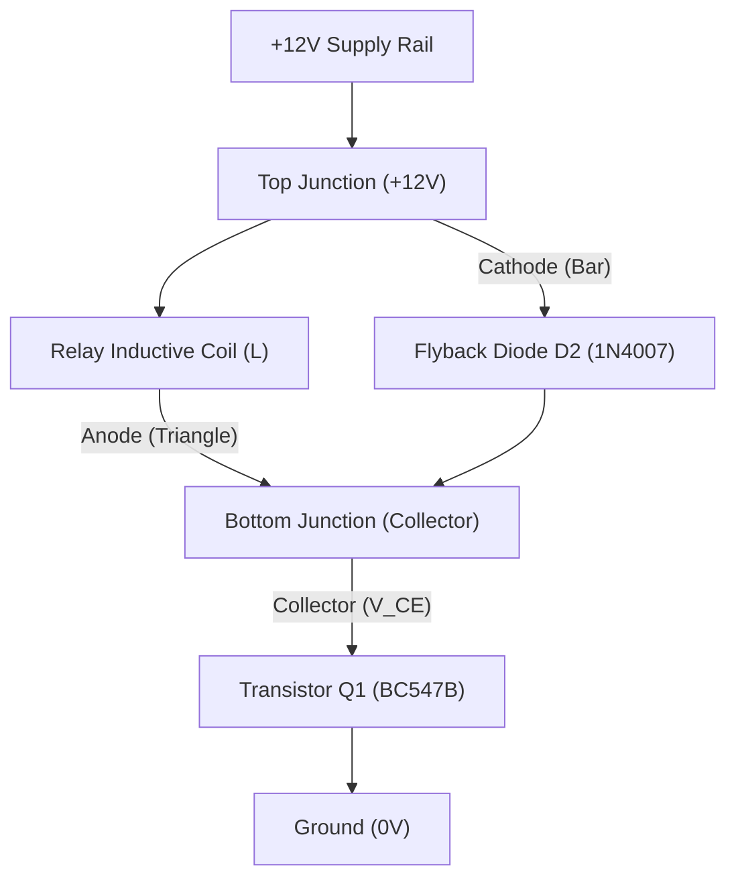

Without protection, this inductive spike can exceed hundreds of volts, easily surpassing the collector-emitter breakdown voltage ($V_{CEO(\text{max})} = 50\text{V}$) of $Q_1$ and destroying the transistor.

- **Anti-Parallel Clamping:** Diode $D_2$ (1N4007 / 1N4148) is connected in anti-parallel directly across the relay coil terminals (cathode to $+12\text{V}$, anode to collector).
- **Normal Operation:** During steady-state ON or OFF conditions, $D_2$ is reverse-biased and draws negligible leakage current ($< 5\,\mu\text{A}$).
- **De-energization Transients:** At the instant $Q_1$ switches off, the collapsing magnetic flux forces inductive current to continue flowing in the same direction. $D_2$ becomes forward-biased, clamping the collector voltage safely to:
  $$V_{CE(\text{peak})} \approx V_{CC} + V_{F(D2)} \approx 12\text{V} + 0.7\text{V} = 12.7\text{V} \ll 50\text{V}$$
- This recirculation loop safely dissipates stored magnetic energy ($\frac{1}{2} L I^2$) as heat within the coil winding resistance, protecting both $Q_1$ and the DC power rail.

---

## Bill of Materials (BOM)

| Component                   | Schematic Designator | Tinkercad Designator | Specification / Model                                | Package        | Qty | Functional Role                           |
| :-------------------------- | :------------------: | :------------------: | :--------------------------------------------------- | :------------- | :-: | :---------------------------------------- |
| **Operational Amplifier**   | `IC1`                | `U1`                 | LM741CN (Single General Purpose)                     | DIP-8          |  1  | Open-loop differential voltage comparator |
| **NPN BJT Transistor**      | `Q1`                 | `T1`                 | BC547B ($h_{FE} \approx 200\text{--}450$)            | TO-92          |  1  | Relay coil current amplifier switch       |
| **Electromechanical Relay** | `RL1`                | `K2`                 | 12V DC SPDT Relay (Contact: 3A/125VAC, 3A/24VDC)     | Through-Hole   |  1  | High-current isolated load switching      |
| **DC Water Pump**           | `MT1`                | `M1`                 | 12V DC Miniature Fluid Motor                         | Standalone     |  1  | Irrigation water delivery actuator        |
| **Rotary Potentiometer**    | `VR1`                | `RPOT3`              | $100\text{ k}\Omega$ Linear Rotary                   | Panel/THT      |  1  | Threshold sensitivity calibration divider |
| **Pull-Up Resistor**        | `R3`                 | `R1`                 | $100\text{ k}\Omega \pm 5\%$ (1/4W Carbon Film)      | Axial          |  1  | Soil probe voltage divider bias           |
| **Simulated Soil Probe**    | `R4`                 | `RPOT2`              | $100\text{ k}\Omega$ Resistor / Dual Electrode Probe | Axial / Probe  |  1  | Soil moisture conductometric sensor       |
| **Base Resistor**           | `R1`                 | `R3`                 | $2.2\text{ k}\Omega \pm 5\%$ (1/4W Carbon Film)      | Axial          |  1  | Op-amp output base current limiter        |
| **Bleeder Resistor**        | `R2`                 | `R2`                 | $2.2\text{ k}\Omega \pm 5\%$ (1/4W Carbon Film)      | Axial          |  1  | Base pull-down to ensure clean cutoff     |
| **Status Indicator**        | `D1`                 | `D1`                 | $5\text{mm}$ High-Efficiency Red LED                 | Radial         |  1  | Visual pump active indicator & level drop |
| **Flyback Diode**           | `D2`                 | `D2`                 | 1N4007 / 1N4148 (Fast Recovery)                      | DO-41 / DO-35  |  1  | Inductive reverse-EMF spike clamp         |
| **Power Supply**            | `B1`                 | `P1`                 | 12V DC Bench PSU or Battery Source                   | DC Jack / Term |  1  | System $V_{CC}$ and motor power supply    |

---

## Circuit Schematics & Wiring Diagrams

### Academic Circuit Schematic Diagram

The complete engineering schematic diagram showing standardized circuit designators (`IC1`, `VR1`, `R1`--`R4`, `Q1`, `RL1`, `MT1`):

<p align="center">
  
</p>
<p align="center">
  <em>Figure 2: Complete academic circuit schematic diagram highlighting the LM741 op-amp comparator, voltage dividers, and relay output driver stage.</em>
</p>

---

### Autodesk Tinkercad Schematic Diagram

The electronic schematic generated directly within Autodesk Tinkercad simulation, detailing native CAD component identifiers (`U1`, `RPOT2`, `RPOT3`, `R1`--`R3`, `T1`, `K2`, `M1`):

<p align="center">
  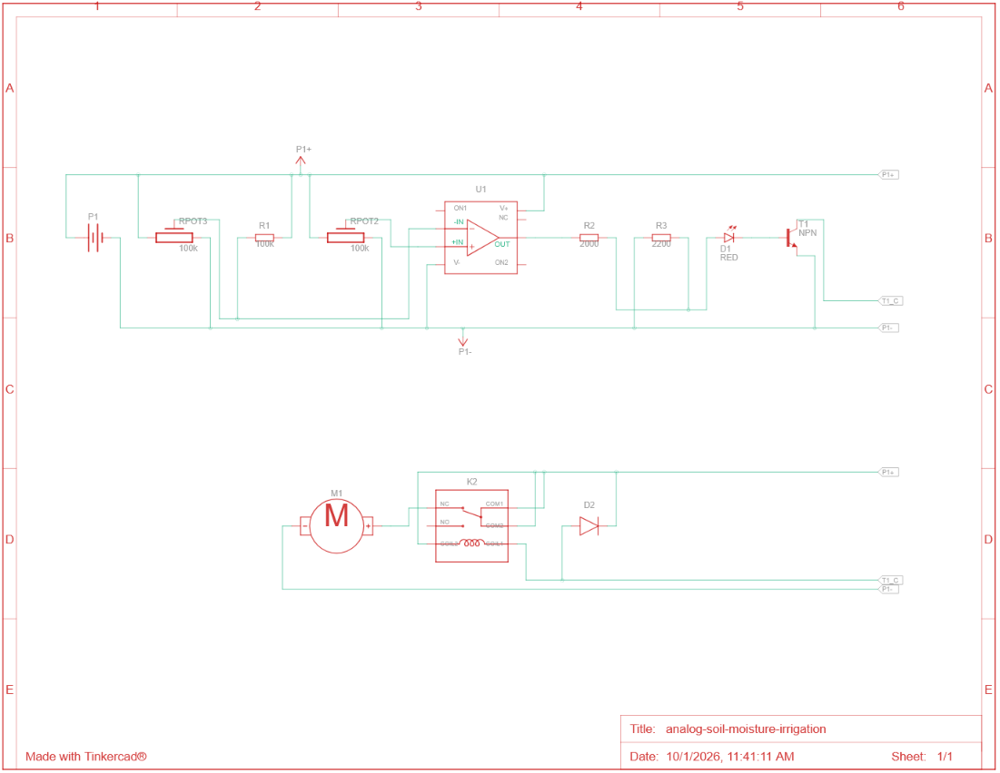
</p>
<p align="center">
  <em>Figure 3: Autodesk Tinkercad schematic diagram illustrating virtual simulation components and node interconnections.</em>
</p>

---

### Tinkercad Simulation Breadboard Layout

Virtual breadboard wiring and interactive component placement modeled in Autodesk Tinkercad:

<p align="center">
  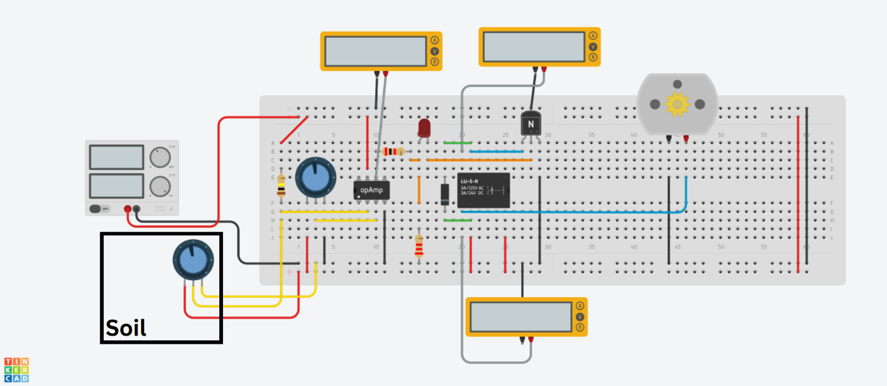
</p>
<p align="center">
  <em>Figure 4: Tinkercad virtual breadboard setup with dual multimeters monitoring probe potential and comparator output voltage.</em>
</p>

---

## Interactive Tinkercad Simulation

You can interactively simulate, test, and verify the circuit behavior directly inside your browser without installing any software:

[Open Tinkercad Simulation Model](https://www.tinkercad.com/things/eXeidWZeQMe-analog-soil-moisture-irrigation)

### Simulation Testing Procedure:

1. Click the link above to open the public Tinkercad project.
2. Click **Start Simulation**.
3. Locate the potentiometer representing the **Soil Resistance (`R_soil` / `RPOT2`)**:
   - **Rotate counter-clockwise (High Resistance / Dry):** Notice the multimeter voltage rising, the red LED lighting up, the relay clicking closed, and the 12V DC motor spinning.
   - **Rotate clockwise (Low Resistance / Wet):** The probe voltage drops below $V_{\text{ref}}$, the op-amp output switches low, the LED extinguishes, and the water pump ceases rotation.
4. Adjust the threshold potentiometer ($VR_1$ / `RPOT3`) to observe how the trip point shifts.

---

## Hardware Prototype & Breadboard Verification

The analog circuit was physically assembled and validated on a standard solderless breadboard to confirm real-world performance:

<p align="center">
  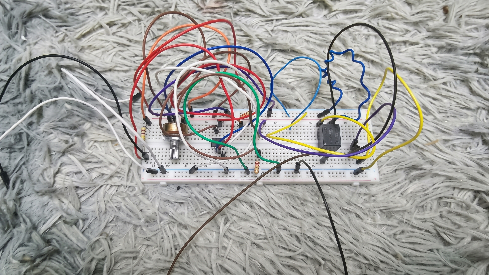
</p>
<p align="center">
  <em>Figure 5: Physical breadboard implementation featuring the LM741 op-amp, BC547B transistor, 12V SPDT relay, calibration potentiometer, and test probes.</em>
</p>

### Live Operation Demonstration

<p align="center">
  
</p>
<p align="center">
  <em>Figure 6: Live hardware test demonstration showing the automated irrigation cycle. The 12V DC pump engages when dry conditions are detected and automatically stops once water reaches the probe electrodes.</em>
</p>

### Verification Results

| Operating Condition     | Soil Resistance ($R_{\text{soil}}$) |        Probe Voltage ($V_+$)         | Reference Voltage ($V_-$) |     LM741 Pin 6 Output      | Transistor State |     Relay State     |      Water Pump       |
| :---------------------- | :---------------------------------: | :----------------------------------: | :-----------------------: | :-------------------------: | :--------------: | :-----------------: | :-------------------: |
| **Dry Soil (Trigger)**  |       $> 120\text{ k}\Omega$        | $\approx 6.5\text{V} - 11.2\text{V}$ |  $6.0\text{V}$ (Preset)   |   $+10.5\text{V}$ (High)    |   Saturated ON   | Energized (Closed)  | **ACTIVE (Spinning)** |
| **Moist Soil (Normal)** |        $< 40\text{ k}\Omega$        | $\approx 1.2\text{V} - 3.4\text{V}$  |  $6.0\text{V}$ (Preset)   | $\approx 1.2\text{V}$ (Low) |    Cutoff OFF    | De-energized (Open) |    **OFF (Idle)**     |

---

## Engineering Analysis & Observations

### 1. Single-Supply Op-Amp Saturation Margin

The classic LM741 was originally designed for dual-rail power supplies ($\pm 15\text{V}$). When operated from a single $+12\text{V}$ rail with negative rail at ground ($0\text{V}$):

- Output low saturation ($V_{OL}$) does not reach true $0\text{V}$; it typically bottoms out around $+1.2\text{V}$ to $+1.8\text{V}$.
- Placing LED $D_1$ (forward voltage $V_F \approx 1.8\text{V} - 2.0\text{V}$) in series with the base of $Q_1$, together with bleeder resistor $R_2$, ensures that the transistor base voltage remains strictly below $V_{BE(\text{on})} \approx 0.65\text{V}$ when the comparator is in the low state, preventing phantom relay triggering.

### 2. Galvanic Probe Corrosion (DC Electrolysis)

- **Challenge:** Continuous direct current (DC) flowing through conducting probes embedded in wet, ionic soil induces galvanic corrosion and oxidation on the anode probe over extended periods.
- **Engineering Mitigation:** In commercial deployments, DC excitation can be replaced with AC square-wave excitation (555 timer or astable multivibrator), capacitive non-contact sensing, or gold-plated / graphite electrode substrates.

### 3. Substrate Composition & Salinity Variance

- Soil electrical conductivity varies not only with moisture but also with mineral content, fertilizer salts, and compaction.
- The inclusion of rotary potentiometer $VR_1$ allows easy on-site threshold adjustment for different soil types without modifying circuit values.

### 4. Relay Chattering & Hysteresis Improvement

- In open-loop comparator mode, slow transitions across the threshold in drying soil can occasionally cause rapid relay chatter.
- Adding a high-value positive feedback resistor (e.g., $1\text{ M}\Omega$) between Pin 6 and Pin 3 converts the circuit into a **Schmitt Trigger**, introducing $50\text{--}100\text{ mV}$ of hysteresis to guarantee crisp relay switching.

---

## Repository Structure

```
analog-soil-moisture-irrigation/
├── README.md                          # Comprehensive project documentation
├── docs/
│   ├── soil_moisture_report_th.pdf    # Full academic project report (Thai)
│   └── images/
│       ├── irrigation_demo.gif        # Live hardware demonstration animation
│       ├── schematic.png              # Annotated circuit schematic diagram
│       ├── tinkercad_breadboard.png   # Tinkercad breadboard layout
│       ├── tinkercad_schematic.png    # Tinkercad schematic diagram
│       └── breadboard_hardware.png    # Physical breadboard prototype photo
└── simulation/
    └── tinkercad_link.txt             # Public Tinkercad simulation URL
```

---

## Author

Developed as an analog electronics circuit design laboratory project for **EL214 Basic Circuit and Electronics** at Bangkok University.

- **Apisit Suansane** [@kengmaikinpak](https://github.com/kengmaikinpak)
- **Anantachai Mingkhwan** [@Ear-z](https://github.com/Ear-z)
- **Amarin Phola** [@amarinphol-blip](https://github.com/amarinphol-blip)
- **Thanakirt Kaewkhiaw** [@Tnk2202](https://github.com/Tnk2202)
